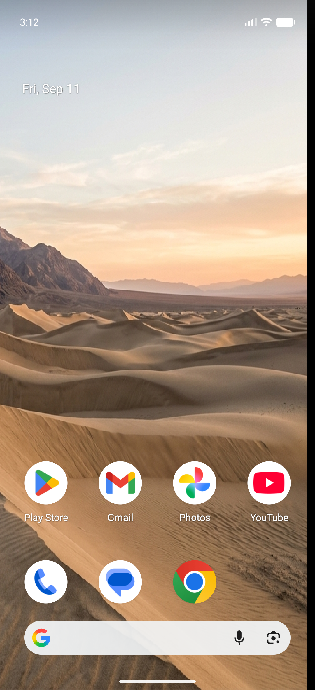
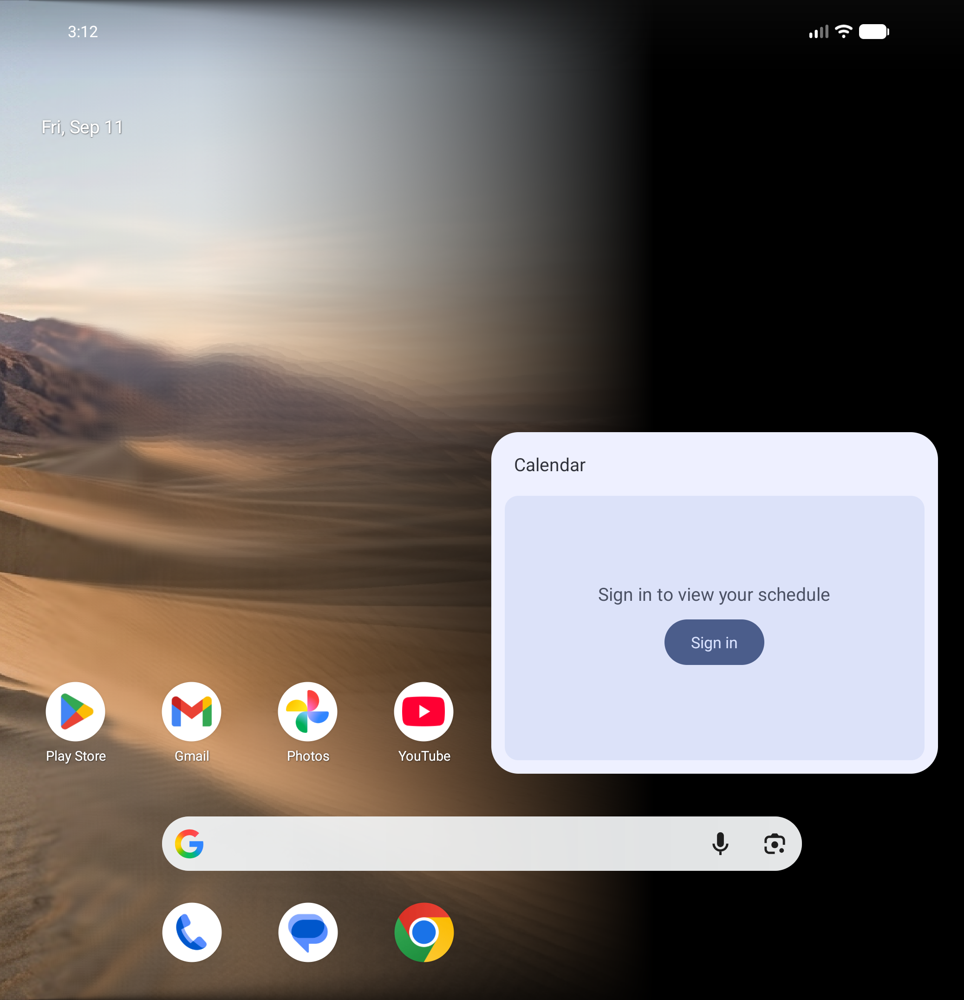
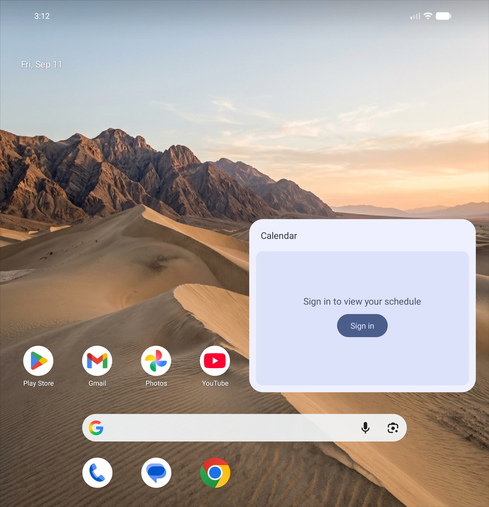

# Duo Fold Wallpaper (Android Transition Animations)

[](https://github.com/DJ-vekariya/android_transition_animations-/actions/workflows/build.yml)
[](https://opensource.org/licenses/MIT)
[](https://android-arsenal.com/api?level=33)
[](https://developer.android.com/guide/topics/ui/foldables)
[](https://dj-vekariya.github.io/android_transition_animations-/)

> **"Apple spent 7 years and $1,999 on this fold animation. I put it on Android as an open-source live wallpaper."**

An open-source Android live wallpaper that ports the viral **iPhone Duo fold-transition effect** (hinge-anchored ray-plane perspective compression, progressive progressive blur, and cover-display window projection) to Android foldables (Google Pixel Fold / 9 Pro Fold / 10 Pro Fold, Samsung Galaxy Z Fold series, and more).

Powered by `Sensor.TYPE_HINGE_ANGLE` and a hardware-accelerated **AGSL (Android Graphics Shading Language) `RuntimeShader`**.

---

## 🌐 Live In-Browser Angle Showcase

Don't have a foldable nearby? Scrub through the fold transition in your browser with our interactive 0°→180° viewer:

👉 **[Launch Interactive 0° to 180° Angle Showcase](https://dj-vekariya.github.io/android_transition_animations-/)**

*(Also available locally in [`docs/index.html`](./docs/index.html) or [`DuoFold_Showcase.html`](./DuoFold_Showcase.html)).*

---

## 📸 Visual Transition Stages

| 0° — Cover Screen Window | 90° — Tabletop Compression & Blur | 180° — Flat Unfolded Landscape |
|:---:|:---:|:---:|
|  |  |  |
| *Outer screen acts as a "window" anchored at the fold.* | *Left panel recedes with ray-plane warp & 25-tap blur.* | *Seamless, crystal-clear 1:1 wallpaper alignment.* |

---

## ⚡ Key Engineering Features

1. **Hardware Hinge-Angle Sensor Integration (`Sensor.TYPE_HINGE_ANGLE`)**
   - Driven at 120 Hz using Android's native hinge-angle sensor API.
   - Low-pass smoothing filter eliminates physical sensor jitter without sluggish latency.

2. **Battery-Conscious Choreographer Loop**
   - Renders only when motion is detected! The `Choreographer.FrameCallback` automatically pauses when the hinge settles, preventing battery drain while idling.

3. **2D AGSL Ray-Plane Perspective Shader (`ShaderCode.kt`)**
   - Calculates dynamic depth foreshortening: $z = d \cdot \sin(\theta)$ and perspective scaling: $S = \frac{E}{E + z}$.
   - Replicates true 3D edge-on projection with cosine compression: $X_{\text{warped}} = X_{\text{hinge}} - d \cdot \cos(\theta) \cdot S$.
   - **Original-UV Gradient Mapping**: Ensures the non-folding panel remains 100% sharp and bright without color void artifacts or horizontal streaking.

4. **Dual-Resolution 25-Tap Progressive Blur**
   - Scaled 5×5 weighted Gaussian kernel with downscaled texture sampling, delivering smooth optical blur matching high-order mip-chain lookups.

5. **Multi-Display Engine Architecture (`DuoWallpaperService.kt`)**
   - Instantiates an independent `WallpaperService.Engine` per physical display (`Display.DEFAULT_DISPLAY` vs secondary cover display).
   - Projects an affine crop of the inner canonical image onto the cover screen so the closed phone behaves like a viewport into the unfolded canvas.

6. **Dynamic Hardware Abstraction (`DeviceConfig.kt`)**
   - Zero hardcoded magic numbers. Display geometry, hinge positions, and perspective ratios are computed dynamically from `DisplayManager` and device specs.
   - Pre-calibrated profiles for **Pixel 10 Pro Fold**, **Galaxy Z Fold 6**, **Galaxy Z Fold 8**, and generic fallback.

7. **Custom Wallpaper Picker & Built-In Demo Mode**
   - Pick any image from storage; the app stores it internally and reloads the live shader immediately.
   - Built-in **Demo Mode** toggles continuous cosine fold cycles for demonstration and screen recordings.
   - Integrated settings directly in the system live wallpaper previewer via `android:settingsActivity`.

---

## ⚖️ Legal Disclaimer

> *Not affiliated with, sponsored by, or endorsed by Apple Inc. or Samsung Electronics Co., Ltd. Contains no proprietary Apple or Samsung assets; all visual effects, math, and shaders are original implementations built from scratch.*

---

## 📱 Hardware & One UI Notes

### Testing Display Engine Allocation
Android supports multi-display wallpapers, but OEM behavior varies across software updates. To verify whether your system provides a separate wallpaper surface for the cover screen:

```bash
adb logcat -s DuoWallpaperService
```

When folding and unfolding, look for:
```
D DuoWallpaperService: Engine bound to displayId=0 outer=false
D DuoWallpaperService: Engine bound to displayId=1 outer=true
```
- **If both appear**: Your device supports full dual-screen rendering with the outer window effect.
- **If only `displayId=0` appears**: The device runs in single-engine mode; the inner display transition runs at full fidelity, while the cover display displays the standard static crop.

---

## 🛠️ Build & Installation

### Requirements
- Android Studio Hedgehog (2023.1.1) or newer
- JDK 17
- Android SDK 35 (Minimum API 33 required for AGSL `RuntimeShader`)

### Compile and Sideload
```bash
# Clone the repository
git clone https://github.com/DJ-vekariya/android_transition_animations-.git
cd android_transition_animations-

# Build debug APK
./gradlew assembleDebug

# Install via ADB
adb install -r app/build/outputs/apk/debug/app-debug.apk
```

### Setting the Wallpaper
1. Launch **Duo Fold Wallpaper** from your app drawer.
2. Tap **"Choose Image"** to select a wallpaper (or keep the default mountain landscape).
3. Tap **"Set as Live Wallpaper"** and apply to Home and Lock Screen.
4. Fold your phone to watch the transition!

---

## 🧪 Testing with the Android Emulator

No foldable device? Test using the Android Studio Emulator:
```bash
# Set hinge angle to 90° (Tabletop mode)
adb emu sensor set hinge-angle0 90

# Set hinge angle to 180° (Flat unfolded)
adb emu sensor set hinge-angle0 180

# Set hinge angle to 0° (Fully closed)
adb emu sensor set hinge-angle0 0
```

---

## 📂 Repository Structure

```
android_transition_animations-/
├── app/
│   ├── src/main/java/com/example/duofoldwallpaper/
│   │   ├── DeviceConfig.kt         # Hardware geometry & display detection
│   │   ├── DuoWallpaperService.kt  # WallpaperService & per-display Engine
│   │   ├── FoldMath.kt             # Projection math, smoothstep, timing curves
│   │   ├── MainActivity.kt         # User settings, image picker, demo switch
│   │   └── ShaderCode.kt           # AGSL 25-tap blur & perspective shader
│   └── src/main/res/               # Resources, layout, wallpaper metadata
├── docs/
│   ├── index.html                  # Interactive 0°–180° GitHub Pages showcase
│   ├── FOLD_ANGLES_SHOWCASE.md     # 10° step visual breakdown & analysis
│   ├── SEED_ISSUES.md              # Ready-to-use contributor issues
│   └── screenshots/                # Showcase captures across all angles
├── tools/
│   └── build_showcase.py           # Automated showcase generator script
├── .github/
│   ├── workflows/build.yml         # GitHub Actions CI build pipeline
│   └── ISSUE_TEMPLATE/             # Bug report & feature request templates
├── CONTRIBUTING.md                 # Contribution guidelines
├── ROADMAP.md                      # Upcoming features & optimizations
└── LICENSE                         # MIT License
```

---

## 🤝 Contributing

Contributions are warmly welcome! Whether you want to calibrate device ratios, optimize the AGSL kernel, or add Z Flip clamshell orientation:
- Check out [`CONTRIBUTING.md`](./CONTRIBUTING.md) for guidelines.
- Pick a starter task from [`docs/SEED_ISSUES.md`](./docs/SEED_ISSUES.md).
- See what's coming up in [`ROADMAP.md`](./ROADMAP.md).

---

## 🏷️ GitHub Topics
`android`, `live-wallpaper`, `agsl`, `runtime-shader`, `foldable`, `galaxy-z-fold`, `pixel-fold`, `hinge-angle-sensor`, `jetpack`, `kotlin`

---

## 📄 License
This project is licensed under the [MIT License](./LICENSE) © 2026 Dev Vekariya.
